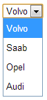
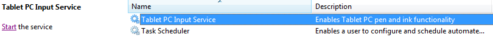
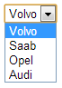

Recently I noticed that dropdowns (&lt;select&gt;) in chrome suddenly had an excessive amount of padding on my Windows 7 PC.  This is what it looked like.

I did some digging on the web and found a [chromium bug report](http://code.google.com/p/chromium/issues/detail?id=146745).

One of the comments near the end of the page gives the solution to the problem.

> Actually that is the problem. Windows has a service called "Tablet PC Input Service". When this is running Windows 7 thinks it's a tablet instead of a desktop. Once I turned this off and restarted chrome the drop down spacing is correct. But as soon as I turn the service back on the extra spacing comes back.

Sure enough, there was a service running on my laptop called "Tablet PC Input Service".

...and when I stopped the service _**and restarted chrome**_, the padding went back to normal.

My laptop is a touchscreen and turning off this service doesn't seem to affect touchscreen functionality.  Don't forget to change the service startup type to "Manual" or "Disabled" so that it doesn't start back up the next time you log on.

This [Google Groups post](http://productforums.google.com/forum/#!topic/chrome/EIgNjmURGbo) might also be relevant.